# Answer Testing Android Developer – PT. Gerak Bersama Kita

Dokumen ini saya susun untuk menunjukkan kemampuan teknis dalam menyelesaikan problem algoritma, membangun aplikasi Android berbasis Kotlin dan Jetpack Compose, serta melakukan perbaikan UI/UX dengan pendekatan yang konsisten dan terukur.

**Nama Lengkap:** Yondika Vio Landa
**Posisi Dilamar:** Android Developer

- **File Kode:** [GitHub Repository](https://github.com/yondikavl/AD-Test-GERAK)
- **File Desain:** [Figma](https://www.figma.com/design/gYjc1GsNoYYhruiSkxmeCR/Test-Android-Developer-GERAK--Yondika-?node-id=0-1&t=gqGefoYqECyQd3d9-1)
- **Hasil Aplikasi Build:** [Google Drive](https://drive.google.com/drive/folders/1VGT92HCF-iaeSG6ooeQvyj4PUX5ObNcY?usp=sharing)

---

## Jawaban 1 – Akai dan Franco

**Problem:** Hitung nilai minimum tugas ketiga agar total ≥ 100.
**Solusi:**

1. Baca `T` test case.
2. Untuk tiap test case → baca A & B, hitung kekurangan `100 - (A+B)`.
3. Jika hasil < 0, set jadi `0`.
4. Cetak hasil dengan format `Case #X: Y`.

**Sintaks Penting:**

```kotlin
val perlu = (100 - (a + b)).coerceAtLeast(0)
```

**Contoh Input/Output:**

```
Input:
4
50 20
0 0
80 90
39 60

Output:
Case #1: 30
Case #2: 100
Case #3: 0
Case #4: 1
```

---

## Jawaban 2 – Akai Sang Panda Matematikawan

**Problem:** Evaluasi ekspresi matematika step-by-step dengan prioritas operator.
**Pendekatan:** Regex parsing untuk operator prioritas tinggi (`*` dan `:`) serta rendah (`+` dan `-`).

**Contoh Input/Output:**

```
23+16-8*3+4:3
23+16-8*3+4:3
......---....
23+16-24+4:3
.........---
23+16-24+1
-----.....
39-24+1
-----..
15+1
----
16
```

---

## Jawaban 3 – Akai Si Mahasiswa Komputer

**Problem:** Penjadwalan multiprosesor.
**Solusi:** Gunakan `PriorityQueue<CPU>` dengan urutan prioritas:

1. `finishTime` (paling cepat selesai lebih prioritas).
2. `tasksCount` (paling sedikit tugas lebih prioritas).
3. `id` (lebih kecil lebih prioritas).

**Catatan Teknis:**

- Solusi scalable untuk hingga 1 juta tugas.
- Mirip konsep **thread pool scheduler**.

---

## Jawaban 4 – Akai Si Engineer

**Problem:** Aplikasi Android Compose dengan peta dan radius dinamis.

- Integrasi Google Maps SDK Compose.
- Render `Circle` sesuai state.
- Update radius/titik setiap interaksi.

<p align="center">
  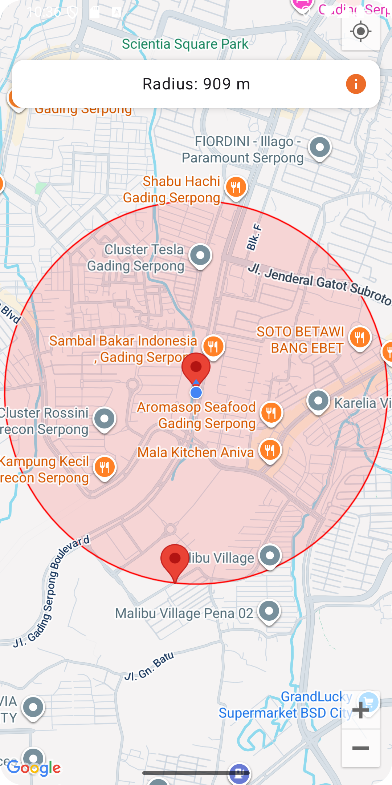
  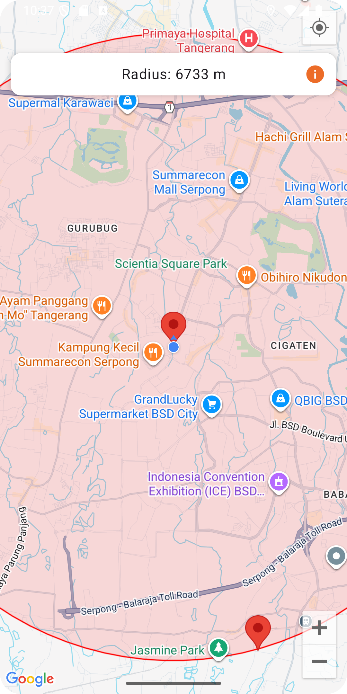
</p>

---

## Jawaban 5 – Akai Si Engineer 2

**Problem:** Game sederhana berbasis lokasi (Gerak GO).

- User dapat poin saat memasuki radius checkpoint (1 km).
- Marker merah → checkpoint belum dikunjungi.
- Marker hijau → checkpoint sudah dikunjungi.

**Logika Utama:**

```kotlin
if (distance <= 1000 && !isVisited) {
    visitedCheckpoints.add(point)
    score += 10
}
```

<p align="center">
  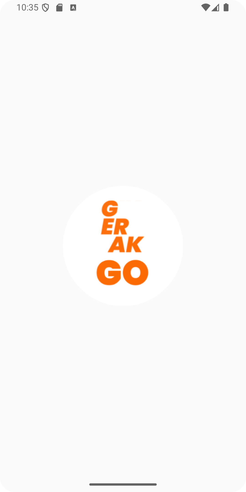
  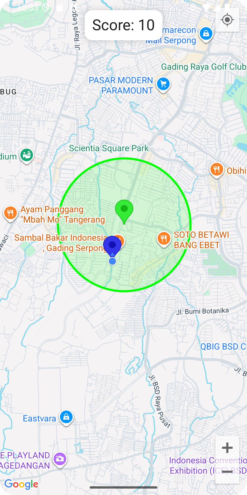
  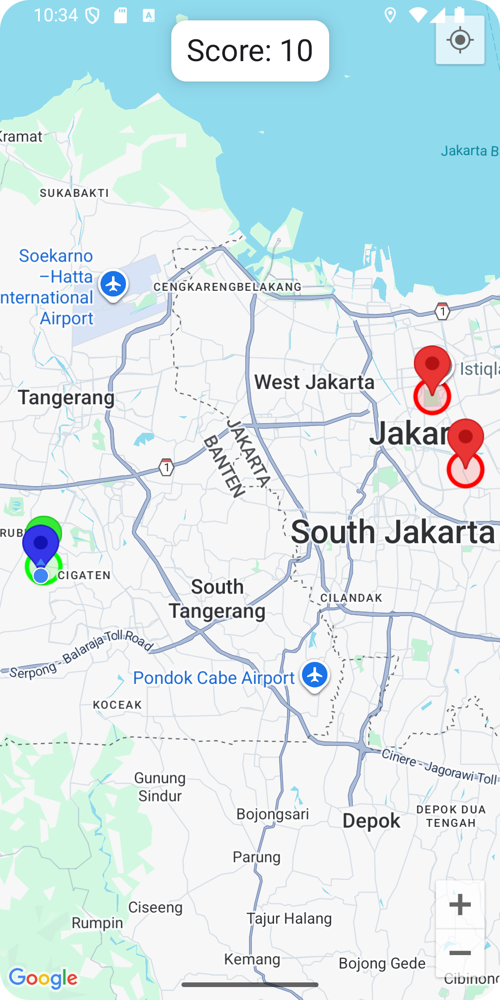
</p>

---

## Jawaban 6 – Akai Si Engineer 3

**Problem:** Aplikasi Android menampilkan daftar karyawan dari API eksternal dengan arsitektur MVVM.

**Komponen Utama:**

- **Retrofit + Gson:** Fetch data dari API.
- **Repository:** Jembatan antara ViewModel & ApiService.
- **StateFlow:** Mengelola state reaktif.
- **Compose UI:** Render daftar dengan `LazyColumn`.

<p align="center">
  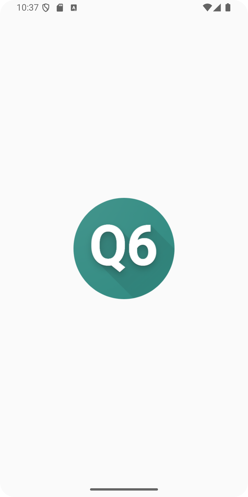
  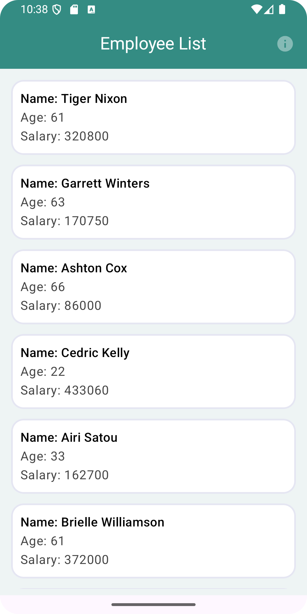
  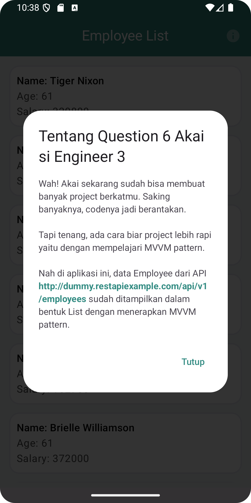
</p>

---

## Jawaban 7 – Memperbaiki UI

**Sebelum vs Sesudah:**

- Lebih kontras dengan background putih + aksen oranye.
- Branding konsisten.
- Typography lebih bersih.
- Button lebih harmonis dengan Material 3.

<p align="center">
  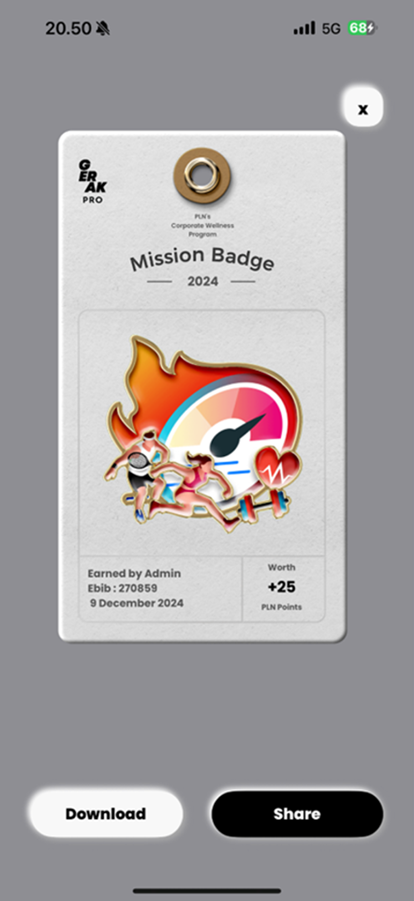
  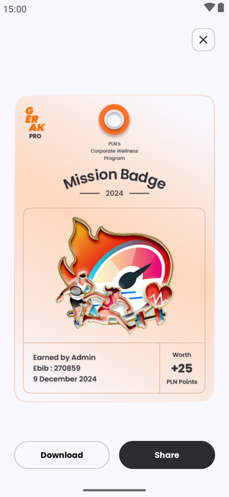
</p>

---

## Jawaban 8 – Memperbaiki UI Part 2

**Perbaikan yang dilakukan:**

- Judul lebih proporsional.
- Font ukuran lebih konsisten.
- Tag Mood dengan spacing lebih rapi.
- TextArea diperbesar agar lebih nyaman digunakan.
- CTA `Log Mood` lebih menonjol.

**Hasil Akhir:**

- Lebih dekat dengan desain Figma.
- Hierarki visual lebih jelas.
- Konsistensi padding & spacing.
- Responsif di berbagai ukuran layar.

<p align="center">
  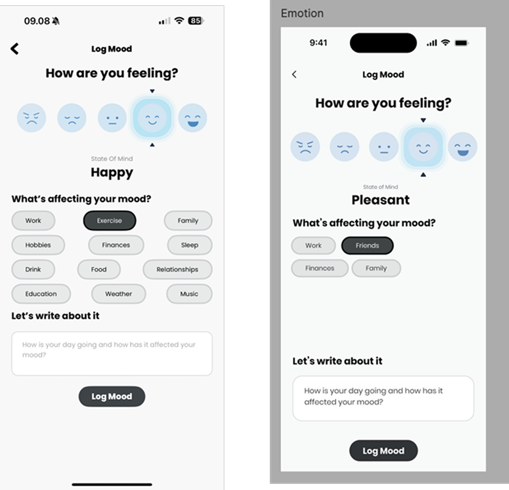
  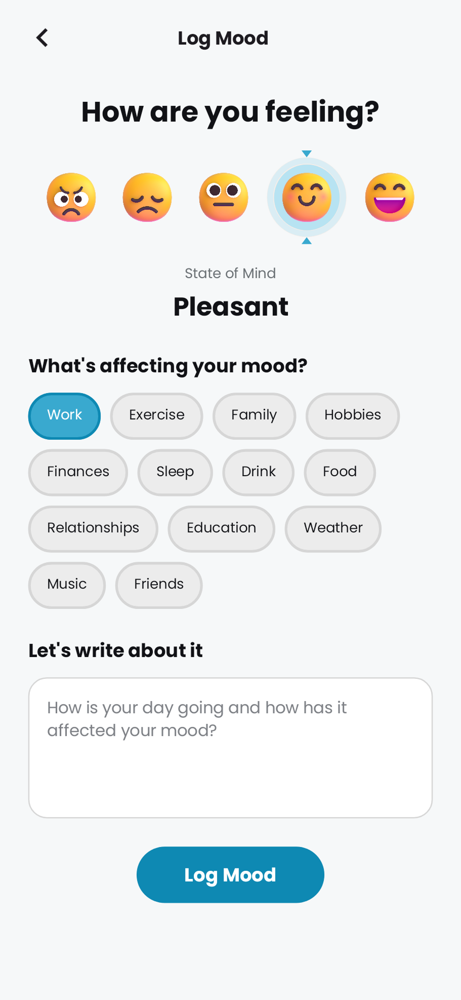
</p>

---

## Kontak

**Nama Lengkap:** Yondika Vio Landa
**Email:** [yondikaviolanda@gmail.com](mailto:yondikaviolanda@gmail.com)
**WhatsApp:** +62 895 6050 86353
